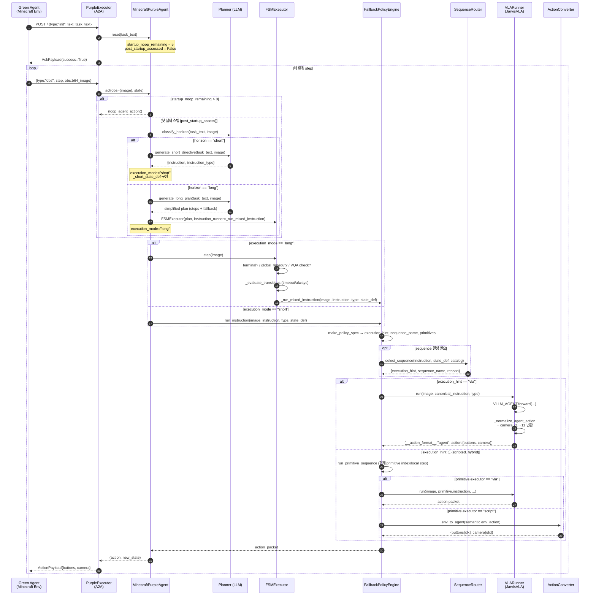
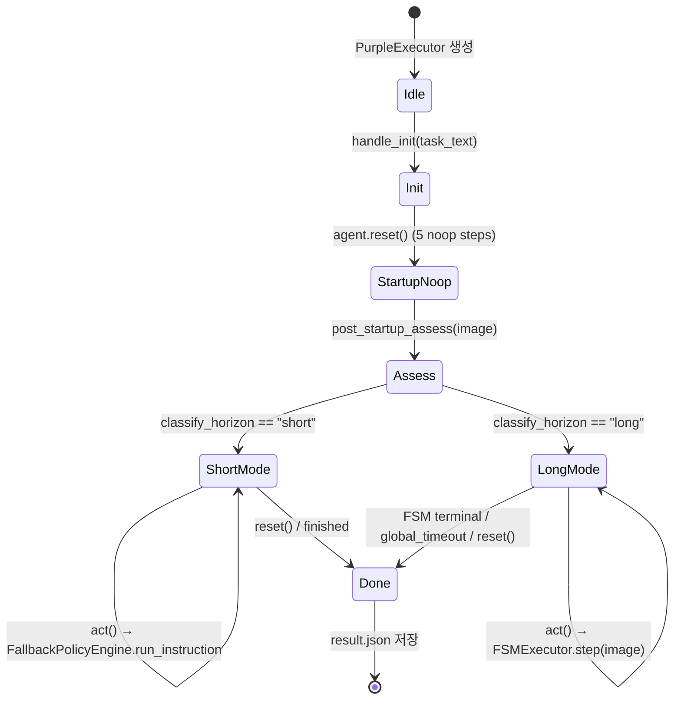

# JarvisVLA Purple Agent — 아키텍처 분석 문서

> 대상 코드베이스: `AgentBeats-JarvisVLA/src/`
>
> 한 문장 요약: **A2A 프로토콜로 들어온 `task_text`를 LLM Planner가 short / long horizon으로 분류한 뒤, FSM Executor와 (VLA · Scripted · Hybrid) 정책 라우터를 거쳐 매 스텝마다 Minecraft `(buttons, camera)` 액션을 생성·반환하는 Purple Agent.**

---

## 0. 디렉터리 한눈에 보기

```
src/
├── __init__.py                    # "LLM Planner + FSM Executor + VLM State Checker"
├── action/
│   └── converter.py               # env_action ↔ agent_action(=Purple compact)
├── agent/
│   ├── agent.py                   # MinecraftPurpleAgent (top-level orchestrator)
│   ├── fallback_policy.py         # FallbackPolicyEngine (Policy Spec + Primitive runner)
│   ├── sequence_router.py         # SequenceRouter (instruction → scripted sequence)
│   └── vla_runner.py              # VLARunner (JarvisVLA VLLM 호출 wrapper)
├── executor/
│   └── fsm_executor.py            # FSMExecutor (timeout-only FSM 인터프리터)
├── planner/
│   ├── planner.py                 # LLM 기반 Planner (horizon/short/long/VQA)
│   ├── plan_format.py             # canonical ↔ simplified plan 변환
│   ├── instruction_registry.py    # instructions.json 기반 strict key 정규화
│   ├── prompt_template.py         # Planner LLM 프롬프트 템플릿 모음
│   └── validator.py               # Plan 구조 / instruction key 검증
├── protocol/
│   └── models.py                  # A2A InitPayload / ObservationPayload / ActionPayload
└── server/
    ├── app.py                     # uvicorn + a2a Starlette 앱 진입점
    ├── executor.py                # PurpleExecutor (A2A ↔ Agent 어댑터)
    └── session_manager.py         # 세션/컨텍스트 관리
```

코드 주석에 있는 한 줄 슬로건이 시스템의 본질을 그대로 보여줍니다:

```1:1:AgentBeats-JarvisVLA/src/__init__.py
"""Minecraft Scripted Policy - LLM Planner + FSM Executor + VLM State Checker"""
```

---

## 1. End-to-End 처리 흐름 (Task Instruction → Action)

### 1.1 Mermaid Sequence Diagram (전체 플로우)



### 1.2 한 스텝 내부의 Component 호출 트리

```
PurpleExecutor._handle_obs(obs_payload, context_id)
└─ _decode_image(b64) → np.ndarray (RGB, HxWx3)
   └─ MinecraftPurpleAgent.act(obs={"image": ...}, state)
      ├─ [Phase A] startup noop guard       ── 환경 초기 5스텝 안정화
      ├─ [Phase B] _post_startup_assess()    ── 1회만 (Plan 생성 + 모드 결정)
      │     ├─ Planner.classify_horizon() ──► HORIZON_SYSTEM_PROMPT + image
      │     ├─ (short) Planner.generate_short_directive()
      │     │     └─ canonicalize_strict_instruction_key()
      │     └─ (long)  Planner.generate_long_plan()
      │           ├─ build_planner_prompt() + few-shot 강건화
      │           ├─ _call_llm() → _parse_json()
      │           ├─ to_canonical_plan() / normalize_instruction_keys()
      │           ├─ ensure_timeout_fallback()
      │           ├─ PlanValidator.validate()
      │           └─ canonical_to_simplified_plan()
      │     ↓
      │     FSMExecutor(plan, instruction_runner=_run_mixed_instruction, vqa_checker)
      │
      └─ [Phase C] action 생성
            ├─ (long)  FSMExecutor.step(image)
            │     ├─ terminal? / global_timeout? → return None
            │     ├─ vqa_checker (interval, optional)
            │     ├─ _evaluate_transitions → always / timeout
            │     └─ instruction_runner(image, instruction, type, state_def)
            │
            └─ (short) FallbackPolicyEngine.run_instruction(...)
                  └─ _run_policy_instruction
                       ├─ make_policy_spec()  ── execution_hint / sequence_name / primitives
                       │     └─ SequenceRouter.select_sequence()
                       │           └─ keyword 우선 → hint 폴백
                       │
                       ├─ "vla"      → VLARunner.run() → VLLM_AGENT.forward()
                       │                                  + _convert_camera_21_to_11()
                       └─ "scripted" / "hybrid"
                             └─ _run_primitive_sequence()
                                  ├─ primitive.executor == "vla"    → VLARunner.run()
                                  └─ primitive.executor == "script" → script_primitive_action()
                                          └─ env_to_agent_action()
                                                └─ ActionConverter.env_to_agent()
                                                      └─ minestudio 또는 fallback numpy
```

---

## 2. 데이터 형식 (Protocol → Plan → Action)

### 2.1 A2A 프로토콜 (`src/protocol/models.py`)

| 메시지 | 방향 | 필드 |
|---|---|---|
| `InitPayload` | Green → Purple | `type="init"`, `text` (task description) |
| `ObservationPayload` | Green → Purple | `type="obs"`, `step`, `obs` (base64 PNG/JPEG) |
| `ActionPayload` | Purple → Green | `type="action"`, `action_type="agent"`, `buttons:list[int]`, `camera:list[int]` |
| `AckPayload` | Purple → Green | `type="ack"`, `success`, `message` |

`obs.obs` 는 base64 인코딩된 이미지로, 서버에서 `_decode_image`가 PIL/numpy로 풀어 `(H, W, 3) uint8` 형태의 RGB ndarray로 만든 뒤 agent로 전달됩니다.

### 2.2 LLM Plan JSON (Long-horizon)

`Planner.generate_long_plan` 출력은 “simplified plan”입니다 (`canonical_to_simplified_plan`).

```json
{
  "task": "<task_text>",
  "step1": {
    "instruction": "mine_block:diamond_ore",
    "instruction_type": "auto",
    "execution_hint": "vla",
    "condition": {"type": "timeout", "max_steps": 6000, "next": "step2"}
  },
  "step2": { ... },
  "fallback": {
    "instruction": "<RAW task_text>",
    "instruction_type": "normal",
    "execution_hint": "vla",
    "condition": {"type": "always", "next": "fallback"}
  }
}
```

`FSMExecutor`는 내부에서 `to_canonical_plan`을 호출해 다음 형태로 다시 정규화합니다:

```json
{
  "task": "...",
  "global_config": {"max_total_steps": 12000, "on_global_timeout": "abort"},
  "initial_state": "step1",
  "states": {
    "step1": {
      "description": "...",
      "instruction": "mine_block:diamond_ore",
      "instruction_type": "auto",
      "execution_hint": "vla",
      "transitions": [
        {"condition": {"type": "timeout", "max_steps": 6000}, "next_state": "step2"}
      ]
    },
    "fallback": { ... },
    ...
  }
}
```

### 2.3 Action Packet (내부 표준)

모든 단계에서 `instruction_runner`가 반환하는 표준 포맷:

```python
{
  "__action_format__": "agent",
  "action": {
    "buttons": np.array([button_idx]),  # 0..2303 (binary-packed) 또는 minestudio 매핑
    "camera":  np.array([camera_idx]),  # 0..120 (11×11 그리드)
  }
}
```

`MinecraftPurpleAgent.act`에서 packet의 `__action_format__`을 검사해 진짜 action만 꺼내고, 그렇지 않으면 `noop_agent_action()`(`buttons=[0], camera=[60(=center)]`)으로 fallback합니다.

`ActionPayload`는 ndarray가 아닌 list로 인코딩되어 와이어로 직렬화됩니다.

---

## 3. Component Deep Dive

### 3.1 `server/app.py` — uvicorn + A2A 부트스트랩

- `argparse`로 Planner / VLA / VLM 설정을 모두 CLI 인자로 받습니다.
- 핵심 의존성:
  - `--vla-checkpoint-path` 와 `--vla-url` (예: `http://localhost:8000/v1`) — JarvisVLA가 띄운 vLLM 서버.
  - `--planner-url`, `--planner-model` — OpenAI-compatible chat endpoint.
- `AgentSkill("Planning-JarvisVLA")` 카드로 노출하고, `DefaultRequestHandler(agent_executor=PurpleExecutor)`로 A2A 메시지를 PurpleExecutor에 위임합니다.

### 3.2 `server/executor.py` — `PurpleExecutor`

- `handle_message(text, context_id)` 가 단일 진입점. JSON 파싱 → `type` 분기.
- `_handle_init`: `agent.reset(task_text)` 호출 + `agent.initial_state(task_text)` 저장. 즉 **task_text는 init 시점에만 들어오고, 이후 매 step 메시지에는 더 이상 task가 실리지 않음**(stateless가 아니라 server-side에 보관).
- `_handle_obs`: base64 이미지 디코드 → `agent.act(obs={"image": image}, state)` → ActionPayload 직렬화. 어떤 단계든 실패하면 `_noop_action_json()`로 안전 폴백.
- A2A 라이브러리 콜백 `async def execute(...)`도 같은 `handle_message`로 위임 (CLI/서버 둘 다 동일 엔트리).

### 3.3 `server/session_manager.py` — 멀티 세션 자료구조

`sessions[session_id] → {created_at, contexts}`, `contexts[context_id] → {session_id, ...}`. 현재 PurpleExecutor는 `context_id`만 키로 쓰고 `agent_states[context_id]`에 `AgentState`를 직접 보관하므로, SessionManager 자체는 어디까지나 등록/추적용.

### 3.4 `agent/agent.py` — `MinecraftPurpleAgent` (Top-level Orchestrator)

이 클래스가 task → action 흐름의 “지휘자”입니다.

**구성 멤버:**
- `self.planner: Planner` — LLM 호출.
- `self.validator: PlanValidator` — plan 검증.
- `self.vla_runner: VLARunner` — JarvisVLA wrapper (의무 의존성).
- `self._action_converter: ActionConverter` — env↔agent 액션 변환.
- `self._sequence_selector: SequenceRouter` — scripted sequence 선택.
- `self._fallback_policy: FallbackPolicyEngine` — 실제 정책 실행 엔진.
- `self._executor: Optional[FSMExecutor]` — long-horizon 시 활성화.

**상태 머신성 멤버 (per-episode):**
- `_execution_mode` ∈ `{"idle","short","long"}`.
- `_short_instruction`, `_short_instruction_type`, `_short_state_def` — short 모드 캐시.
- `_startup_noop_remaining=5` — 환경 안정화 대기.
- `_post_startup_assessed: bool` — Plan 생성을 한 번만 수행.
- `_episode_dir`, `_episode_start` — 결과 저장용.

**`act()` 단계별 로직:**

1. **Phase A — Startup noop guard**
   ```python
   if self._startup_noop_remaining > 0:
       self._startup_noop_remaining -= 1
       return noop_agent_action(), <state with mode="idle">
   ```
   환경이 spawn 직후 검은 화면 / 로딩 화면을 보내는 동안 LLM 호출을 미루기 위함.

2. **Phase B — `_post_startup_assess(image)` (1회만 실행)**
   - `Planner.classify_horizon(task_text, image)` → `"short"` / `"long"`.
   - **short:**
     - `generate_short_directive(...)` → `{instruction, instruction_type}`.
     - `canonicalize_strict_instruction_key(instruction)`로 `kill_entity:zombie` 같은 strict key로 정규화.
     - `_build_short_state_def`로 “execution_hint” + 필요시 “sequence_name” 힌트 생성:
       ```python
       _PREFIX_SEQUENCE_MAP = {
         "drop":        ("scripted", "drop_cycle"),
         "use_item":    ("hybrid",   ""),
         "kill_entity": ("vla",      ""),
         "mine_block":  ("vla",      ""),
         "craft_item":  ("hybrid",   "open_inventory_craft"),
         "pickup":      ("vla",      ""),
       }
       ```
     - `_execution_mode = "short"`, `_short_instruction` 저장.
   - **long:**
     - `generate_long_plan(...)`로 plan 생성.
     - `FSMExecutor(plan, instruction_runner=_run_mixed_instruction, vqa_checker=_vqa_checker)` 생성.
     - `_execution_mode = "long"`.

3. **Phase C — Action 한 스텝 생성**
   - `short`이면 `_run_mixed_instruction(image, instruction, type, state_def)` 직접 호출.
   - `long`이면 `self._executor.step(image)` 호출(내부에서 instruction_runner를 사용).
   - 결과 `action_packet["action"]`을 꺼내 새 `AgentState`와 함께 반환.

4. **에피소드 종료**
   - `_save_episode_result()`이 `_episode_dir/result.json`에 plan, skill_history, total_steps, elapsed 등을 기록.
   - `reset()`이 호출되면 다음 에피소드를 위해 직전 결과를 먼저 저장하고 모든 상태를 초기화.

### 3.5 `planner/planner.py` — `Planner`

OpenAI-compatible Chat Completions API 사용. `_call_llm`은 `observation_image`가 있으면 PIL→JPEG→base64 data URL을 만들어 멀티모달 메시지로 보냅니다. (즉, **모든 LLM 호출은 잠재적 VLM 호출**)

**3 종 LLM 호출:**

1. **`classify_horizon(task_text, image)`**
   - 시스템 프롬프트 `HORIZON_SYSTEM_PROMPT` (decision policy: from-scratch / multi-step → long, 단일 instruction family로 매핑되면 short).
   - JSON 파싱 실패 시 `fallback_classify_task_horizon`(키워드 휴리스틱)으로 폴백.

2. **`generate_short_directive(task_text, image)`**
   - 시스템 프롬프트 `SHORT_DIRECTIVE_SYSTEM_PROMPT` — strict key를 우선 출력하라고 강제.
   - `_build_instruction_examples_addendum(task_text, strict_keys)`로 task와 관련된 예시 키 12개 정도를 프롬프트에 추가 (instructions.json registry 기반 grounding).
   - 결과를 `_repair_instruction_candidate`로 strict key 후보로 재정렬:
     - 직접 canonicalize 시도 → 실패 시 token 추출 후 prefix-매칭 (`kill_entity:zombie` 등) → 그래도 실패하면 raw task_text + `instruction_type="normal"` 폴백.
   - `instruction_type` ∈ `{auto, simple, normal, recipe}`.
   - 최대 `max_retries`회 재시도, 매 회 검증 실패 사유를 `REPLAN_ADDENDUM`으로 프롬프트에 첨부.

3. **`generate_long_plan(task_text, image)`**
   - 시스템 프롬프트 `PLANNER_SYSTEM_PROMPT` — *“timeout-only transitions”*, *“execution_hint ∈ {vla, scripted, hybrid}”*, *“max_steps 1200~12000”*, fallback 단계 강제 등 매우 구체적인 contract.
   - 출력 JSON을 받아:
     1. `to_canonical_plan(parsed, task_text)` — `step1, step2, ...`을 `states`로 변환, transition을 `next_state` 형태로 정규화, 그리고 `_auto_link_linear_steps`로 누락된 step 간 링크를 보완.
     2. `normalize_instruction_keys` — 각 state의 instruction을 canonical key로 변환.
     3. `ensure_timeout_fallback` — 모든 non-fallback state에 timeout transition이 있는지 확인하고 없으면 `→ fallback`을 자동 주입. fallback state가 없으면 `task_text`를 instruction으로 갖는 self-loop fallback을 만들어 줌.
     4. `PlanValidator.validate` + `validate_long_horizon_constraints` — instruction key 유효성, transition 타깃 존재, 도달 가능성, 비-fallback 상태가 ≥2개인지 등을 검사.
   - 검증 실패 시 errors를 프롬프트에 붙여 재시도. 마지막 시도까지 실패하면 직전 plan을 그대로 반환.
   - 최종 출력은 `canonical_to_simplified_plan`으로 step entries 형태로 다시 압축 (외부 노출용).

4. **`vqa_check_subgoal(task_text, state_def, image)`**
   - 옵션: FSMExecutor가 일정 주기로 호출. `{"completed": true|false}` 형식의 답을 파싱.

### 3.6 `planner/instruction_registry.py` — strict key 정규화

- `instructions.json` (실제 파일은 별도 레포의 `jarvisvla/evaluate/assets/instructions.json`)을 LRU-cache로 한 번 로드.
- `prefix:item` 형태(예: `kill_entity:zombie`, `mine_block:diamond_ore`)만 “strict key”로 인정.
- `_expand_candidate_forms`로 공백/대소문자/언더스코어 변형을 alias로 등록.
- `canonicalize_instruction_key("Kill Entity: Zombie")` → `"kill_entity:zombie"` 같은 정규화를 제공.

### 3.7 `planner/plan_format.py` — Plan JSON 변환

- **canonical:** `{ states: { name: {description, instruction, instruction_type, transitions:[{condition, next_state}] } }, initial_state, global_config }`
- **simplified:** `{ task, step1: {instruction, condition:{type, max_steps, next}}, ... }`
- 핵심 유틸:
  - `_extract_steps_dict` — top-level의 임의 dict 키를 step entries로 흡수.
  - `_normalize_transition` — `next` ↔ `next_state`, condition 누락 시 `always`로 보정.
  - `_auto_link_linear_steps` — `step1, step2, …`가 있으면 timeout transition을 step순서대로 linking, 마지막은 `fallback`.
  - `to_canonical_plan` / `canonical_to_simplified_plan`은 정확히 서로의 역.

### 3.8 `planner/validator.py` — `PlanValidator`

- top-level 필드 (`task, states, initial_state, global_config`) 존재 검사.
- 각 state별:
  - terminal이면 `result` 필수.
  - 그 외에는 `instruction`(non-empty string) + `instruction_type` ∈ `{auto, simple, normal, recipe}` + `transitions` 필수.
  - **fallback 외**의 state instruction은 instructions.json 안에 strict key가 존재해야 하며, 없으면:
    - `:`가 없으면 free-form로 허용 (Warning만).
    - `:`가 있으면 오타로 보고 `difflib.get_close_matches` 추천을 함께 띄움.
  - transition `condition.type` ∈ `{always, timeout}`만 허용.
  - 도달 불가능한 state(자동 생성된 `success`/`abort` 제외)는 Warning.

### 3.9 `executor/fsm_executor.py` — `FSMExecutor` (Timeout-only FSM)

설계 키워드: **VLM check 없는 timeout-only FSM**.

- 생성자에서 `to_canonical_plan(plan)`으로 plan 정규화 + `instruction_runner`(필수) + 선택적 `vqa_checker`/`vqa_interval_steps` 주입.
- `step(image)`:
  1. `finished` → `None`.
  2. `total_step_count >= global_max_steps` → `_terminate("global_timeout")` → `None`.
  3. 현재 state가 `terminal` → `_terminate(result)` → `None`.
  4. instruction이 비어있거나 string이 아니면 `_terminate("invalid_policy_no_instruction")`.
  5. **(주기적 VQA)** `vqa_checker`가 있고 `state_step_count % vqa_interval_steps == 0`이면 호출. 결과가 `True`이면 첫 transition의 `next_state`로 강제 이동.
  6. **`_evaluate_transitions`** — `always`면 즉시 transition, `timeout`이면 `state_step_count >= max_steps`일 때 transition. (transition 발생 시 같은 step 안에서 새 state로 다시 평가하기 위해 `for _guard in range(64)` 루프.)
  7. transition 없으면 `instruction_runner(image, instruction, instruction_type, state_def)` 호출 → `_tick()`(state_step_count, total_step_count 둘 다 +1) → action 반환.
- `_transition_to`: state 바뀌면 `state_step_count`만 0으로 리셋(total은 유지).
- `for _guard in range(64)`는 `always` 트랜지션이 cycle을 만들었을 때 stack overflow를 막는 안전장치.

### 3.10 `agent/fallback_policy.py` — `FallbackPolicyEngine` (정책 실행 코어)

문서상 “fallback”이라는 이름과 달리, **모든 non-noop action 생성을 담당**하는 핵심 모듈입니다.

#### (a) 핵심 자료구조

- `_selection_history: list[str]` — 직전 20개의 선택된 sequence/hint를 기록 (episode 결과의 `skill_log`로도 환원).
- `_script_runtime_*` / `_primitive_runtime_*` — 동일 instruction이 들어오는 동안 primitive sequence 진행 상태를 보존하기 위한 stateful 변수들.
- `_selection_runtime_signature`, `_selection_policy_spec` — 같은 instruction에 대해 매번 SequenceRouter를 다시 돌리지 않도록 캐시.
- `script_signature(instruction, state_def)` — `instruction.lower() | description | instruction_type`을 합친 문자열로, primitive runtime을 reset할지 결정하는 키.

#### (b) `make_policy_spec(image, instruction, state_def)`

“이 instruction을 어떤 방식으로 실행할까”를 결정해 다음 dict를 반환:

```python
{
  "execution_hint":  "vla" | "scripted" | "hybrid",
  "sequence_name":   "drop_cycle" | ... | None,
  "primitives":      [ {"executor":"vla"|"script", ...}, ... ],
  "selector_reason": "...",
}
```

결정 우선순위:

1. `state_def["primitives"]`가 이미 정의돼 있으면 그대로 사용 (Planner가 직접 명시한 경우).
2. 그 외에는 `task_text`를 우선 routing 시도 — Planner LLM이 의도를 잘못 해석할 수 있으므로 (예: “lay carpet” → `craft_item:carpet`) 원시 task_text로 한 번 더 키워드 매칭.
3. Planner가 이미 `sequence_name + scripted/hybrid` 힌트를 줬으면 그것을 그대로 사용.
4. 그 외에는 `_select_sequence` (= `SequenceRouter.select_sequence`)로 instruction과 state_def를 보고 결정.
5. `scripted/hybrid`인데 끝까지 sequence를 못 잡으면 안전을 위해 `vla`로 폴백 (경고 로그).

마지막으로 `default_primitives(sequence_name, execution_hint, instruction)`로 primitive list를 생성합니다 — 이 함수에는 약 35개의 사전 정의된 sequence template이 들어 있습니다 (예시):

```python
"open_inventory_craft": [
  {"executor": "script", "primitive": "open_inventory", "steps": 6},
  {"executor": "vla", "instruction_type": "recipe", "steps": 110},
],
"drop_cycle": [
  {"executor": "script", "primitive": "drop_cycle", "steps": 90},
],
"approach_then_vertical_place": [
  {"executor": "vla", "instruction": "face a nearby wall and move close", ..., "steps": 30},
  {"executor": "vla", "instruction": "select an item frame, painting, ...", "steps": 20},
  {"executor": "script", "primitive": "place_wall_use", "steps": 90},
],
```

`vla`인 경우는 `[{executor:"vla", instruction, instruction_type:"auto", steps:999999}]` 단일 primitive로 채웁니다 — “계속 VLA에게 맡겨라”의 의미.

#### (c) `_run_policy_instruction` 실행

- 새 instruction(=signature 변경)이면 primitive runtime을 0으로 리셋.
- `execution_hint == "vla"` → `run_state_instruction` (= `VLARunner.run`) 직접 호출, 단 instruction은 `canonicalize_strict_instruction_key`로 다시 한 번 정규화.
- `scripted/hybrid` + `primitives` → `_run_primitive_sequence` 호출.
- primitive sequence가 끝까지 소진되면 (`return None`) VLA로 안전 폴백.

#### (d) `_run_primitive_sequence` — primitive cursor

`primitives = [P0, P1, P2, ...]`을 cursor 형태로 진행.

```
self._primitive_runtime_index   # 현재 어떤 primitive 인지
self._primitive_runtime_step    # 그 primitive 안에서 몇 step째 인지
```

매 호출마다:
- 현재 primitive를 꺼내 `executor`에 따라 분기:
  - `"vla"` → `VLARunner.run`. instruction은 primitive에 명시된 자연어 (없으면 부모 instruction).
  - `"script"` → `script_primitive_action(primitive_name, local_step, script_key)`로 액션 직접 합성.
- 카운터 +1, `steps_budget`에 도달하면 cursor를 다음 primitive로 이동.
- 이 구조 덕분에 매 환경 step이 들어올 때마다 정확히 하나의 액션을 “계획된 sequence의 다음 한 단계”로 반환할 수 있습니다.

#### (e) `script_primitive_action` & `semantic_script` — 결정형 매크로

수십 개의 primitive 이름(`cycle_hotbar`, `hold_use`, `look_down_use`, `place_row_walk`, `chop_tree`, `drop_cycle`, `melee_attack`, ...)을 `local_step % cycle`로 패턴화한 micro-script.

예시 — `drop_held_item`:

```python
if script_key == "drop_held_item":
    slot = min((step // 14) + 1, 9)
    if step % 14 == 0:
        return {f"hotbar.{slot}": 1}
    return {"drop": 1}
```

→ 14스텝마다 hotbar 슬롯을 바꿔가며 drop 키를 누름 → “들고 있는 아이템 종류를 순환하며 다 떨어뜨리기” 매크로.

각 primitive가 만드는 결과는 *env_action* dict (`{"forward":1, "use":1, "camera":[9.0, 0.0]}` 형식)이고, 곧바로 `env_to_agent_action(env_action)` → `ActionConverter.env_to_agent(...)`로 Purple compact 포맷 `{buttons, camera}`로 변환됩니다.

#### (f) `sequence_catalog()` — Router용 카탈로그

`SequenceRouter.select_sequence`의 인자로 들어가는 dict. 키워드 매칭 결과로 어떤 sequence를 선택할지, 그 sequence의 기본 `execution_hint`가 무엇인지 정의. 약 35개의 시나리오(`drop_cycle`, `consume_cycle`, `approach_then_vertical_place`, `chop_tree_loop`, `melee_combat_loop`, `open_inventory_craft`, ...)가 등록돼 있습니다.

### 3.11 `agent/sequence_router.py` — `SequenceRouter`

- `select_sequence(instruction, state_def, sequence_catalog, require_sequence)` — 두 단계:
  1. **Keyword matching (`_keyword_match`):** instruction과 task_text를 합친 텍스트(언더스코어→공백 정규화)에서 사전 정의된 키워드 그룹을 찾아 카탈로그 엔트리로 매핑. 우선순위가 매우 의도적으로 짜여 있음. 예:
     - `"lay "/"pave "/"floor "` → `line_place_repeat` (반드시 craft 검사보다 앞에 둠으로써 “lay carpet”이 craft route로 빠지는 걸 방지).
     - `"craft" / "craft_item" / "recipe"` → `open_inventory_craft`.
     - `"item frame"/"painting"/"banner"` → `approach_then_vertical_place`.
     - `"chest"/"open"/"container"` → `approach_then_open_interactable`.
  2. **Hint fallback (`_hint_fallback`):** 키워드가 없으면 `state_def["execution_hint"]`를 보고 결정. `vla`면 키워드 한 번 더 시도 후 `default_vla`. `scripted/hybrid`이면 그 힌트 그대로(필요시 키워드 매칭으로 sequence를 함께 채움).

이 라우터는 **stateless 순수 함수**라서 테스트하기 쉽고 결정적입니다.

### 3.12 `agent/vla_runner.py` — `VLARunner`

JarvisVLA 패키지(`jarvisvla.evaluate.agent_wrapper.VLLM_AGENT`)를 한 겹 감싼 어댑터.

- 생성자에서 VLLM 백엔드 클라이언트(checkpoint_path, base_url, api_key 등)를 만들고 `history_num=4`(기본)으로 멀티-프레임 컨텍스트를 유지.
- `run(image, instruction, instruction_type, state_def)`:
  1. `_resolve_instruction_type` — `auto`로 들어왔을 때:
     - `craft_item:`로 시작하면 `recipe`.
     - `prompt_library`에 정확히 들어 있으면 `normal`.
     - 그 외엔 생성자 default.
  2. `self.agent.instruction_type`을 잠깐 바꾸고 `forward(observations=[image], instructions=[instruction], need_crafting_table=...)` 호출.
  3. 결과를 `_normalize_agent_action`로 buttons/camera scalar 추출 + `_convert_camera_21_to_11`로 model의 21×21 grid를 환경의 11×11 grid로 변환.
  4. 표준 packet `{__action_format__:"agent", action:{buttons, camera}}` 반환.
- 어떤 단계든 예외 시 `noop_agent_action()`을 packet에 넣어 안전 폴백.

### 3.13 `action/converter.py` — `ActionConverter`

env↔agent 액션 정밀 변환기.

- 환경(env_action) 표현: 20개 binary button + `camera: np.array([pitch_deg, yaw_deg])` (degrees).
- agent_action 표현: `{"buttons": np.array([idx]), "camera": np.array([idx])}` (Purple compact).
- 우선 minestudio (`ActionTransformer`, `CameraHierarchicalMapping`)가 설치돼 있으면 사용. 없으면 numpy fallback:
  - buttons: 20-bit를 32-bit로 패딩 후 little-endian uint32로 묶어 단일 인덱스 (max 2303).
  - camera: μ-law가 아닌 단순 선형 양자화로 11×11 그리드 인덱스.
- `noop_agent_action`은 `(buttons=[0], camera=[60])` — 60이 11×11 그리드의 정중앙(`5*11 + 5`).

---

## 4. Execution Hint 결정 로직 — 한눈에

| 입력 조건 | 결정 |
|---|---|
| `state_def["primitives"]` 존재 | 그대로 사용, hint = state_def["execution_hint"] or "hybrid" |
| `task_text` 키워드가 catalog에 매칭됨 (Planner 의도 무시) | 그 sequence의 기본 hint 사용 |
| Planner가 `sequence_name + scripted/hybrid` 모두 줌 | 그대로 사용 |
| 그 외 → SequenceRouter | keyword > hint > default_vla |
| `scripted/hybrid` + sequence 못 찾음 | 안전하게 `vla` 폴백 |
| 최종 hint == `vla` | `[{executor:"vla", steps:999999}]`로 single primitive |
| 최종 hint ∈ `{scripted,hybrid}` | `default_primitives` 템플릿 사용 |

---

## 5. Episode Lifecycle (Per-Context)



- 각 phase 변경 시 `_save_episode_result()`가 `output_dir/<safe_task>_<ts>/result.json`에 다음을 기록:
  ```json
  {
    "task": "...",
    "execution_mode": "long",
    "finished": true|false,
    "result": "<terminal result or 'running_short_direct'>",
    "total_steps": 1234,
    "final_state": "step3",
    "skill_history": ["drop_cycle","drop_cycle","vla", ...],
    "skill_log": [{"skill":"drop_cycle","count":2}, {"skill":"vla","count":1}, ...],
    "elapsed_seconds": 56.2,
    "timestamp": "..."
  }
  ```
- `_episode_dir/plan.json`도 함께 저장되어, short 모드일 땐 `{instruction, instruction_type}`, long 모드일 땐 simplified plan dict 전체가 보존됩니다.

---

## 6. 안전성 / 견고성 장치 모음

이 코드베이스에서 시스템이 **항상 어떤 action이든 반환하도록** 만든 장치들을 한 번 모아 보면 시스템 설계 의도가 명확해집니다.

| 위치 | 장치 |
|---|---|
| `MinecraftPurpleAgent.act` | 모든 단계가 `try/except`로 감싸져 있고, 어떤 에러든 `noop_agent_action()` 반환. |
| 같은 위치 | `image is None`, `executor is None`, `short_instruction is None` 모두 noop 폴백. |
| 같은 위치 | `_post_startup_assess`가 예외를 던져도 `_post_startup_assessed = True`로 마킹해 무한 재시도 방지. |
| `Planner._call_llm` | LLM 호출 자체가 실패해도 빈 문자열 반환 → 상위에서 fallback heuristic으로 진행. |
| `Planner.classify_horizon` | LLM이 invalid JSON → `fallback_classify_task_horizon` 키워드 휴리스틱. |
| `Planner.generate_short_directive` | strict key를 못 찾으면 raw task_text + `instruction_type="normal"`로 폴백. |
| `Planner.generate_long_plan` | 검증 실패 N회 후에도 마지막 plan을 그대로 반환 + `ensure_timeout_fallback`이 fallback state를 강제 주입. |
| `FSMExecutor.step` | `for _guard in range(64)`로 transition cycle stack overflow 방지. `instruction_runner`가 None을 리턴하면 noop packet으로 채워줌. |
| `FallbackPolicyEngine.run_instruction` | top-level `try/except`로 감싸 noop packet 폴백. |
| `FallbackPolicyEngine._run_policy_instruction` | scripted/hybrid에서 sequence를 끝까지 못 돌리면 VLA로 강제 폴백. |
| `VLARunner.run` | `forward()` 예외 시 noop packet 반환. |
| `ActionConverter._env_to_agent_minestudio` | 변환 실패 시 noop. |
| `PurpleExecutor._handle_obs` | 메시지 파싱/디코드/state-missing 모두 `_noop_action_json()`. |

이렇게 **모든 경로에서 noop이라는 안전한 출력 보장**이 시스템의 가장 중요한 설계 원칙입니다.

---

## 7. 시나리오 워크스루 — “drop a torch”

빠른 이해를 위한 가상의 한 사이클:

1. Green Agent가 `{"type":"init","text":"drop a torch"}` 전송.
2. `PurpleExecutor._handle_init` → `agent.reset("drop a torch")` → `_startup_noop_remaining=5`.
3. 5번의 obs 동안 noop을 보내며 환경 안정화.
4. 6번째 obs에서 `_post_startup_assess(image)`:
   - `classify_horizon` → `"short"` (단일 instruction family).
   - `generate_short_directive` → `{"instruction":"drop:torch","instruction_type":"auto"}`.
   - `canonicalize_strict_instruction_key("drop:torch")` → `"drop:torch"`.
   - `_PREFIX_SEQUENCE_MAP["drop"]` → `("scripted","drop_cycle")`.
   - `_short_state_def = {"description":"short_direct:drop:torch", "execution_hint":"scripted", "task_text":"drop a torch", "sequence_name":"drop_cycle"}`.
   - `_execution_mode = "short"`.
5. 다음 obs부터 매 스텝:
   - `_run_mixed_instruction(...)` → `FallbackPolicyEngine.run_instruction(...)`.
   - `make_policy_spec`:
     - task_text “drop a torch”에서 `_keyword_match`가 “drop”을 감지 → `drop_cycle` 선택.
     - `default_primitives("drop_cycle","scripted",...)` → `[{"executor":"script","primitive":"drop_cycle","steps":90}]`.
   - `_run_primitive_sequence`가 첫 primitive를 잡고:
     - `script_primitive_action("drop_cycle", local_step=0)` → `semantic_script_action("drop_held_item", 0)` → `env_action = {"hotbar.1":1}` → `env_to_agent({"hotbar.1":1, ...})` → `{buttons:[<idx>], camera:[60]}` packet.
6. `local_step`이 매 스텝 +1되며 14주기로 `hotbar.1 → drop → drop → ... → hotbar.2 → drop → ...` 패턴으로 9개 슬롯을 모두 탐색. 90스텝 budget이 끝나면 다음 primitive로 이동(이 시퀀스는 1개라 끝나면 VLA로 폴백).
7. Green이 done을 통보하거나 새 init을 보내면 `_save_episode_result()`가 호출되어 `result.json`이 기록됨.

같은 시나리오를 “mine diamond from scratch”로 바꾸면:

- `classify_horizon` → `"long"`.
- `generate_long_plan` → step1=`mine_block:cobblestone`, step2=`craft_item:wooden_pickaxe`, step3=`mine_block:iron_ore`, step4=`craft_item:iron_pickaxe`, step5=`mine_block:diamond_ore`, fallback=raw task_text 같은 형태로 LLM이 단계화.
- `FSMExecutor`가 각 step의 `max_steps` 동안 instruction_runner를 호출. 각 step의 `execution_hint`가 `vla`면 `VLARunner.run`이 매 스텝 액션을 만들어줌.
- 어떤 step도 `max_steps`를 다 쓰면 `timeout` transition으로 다음 step → 마지막엔 fallback에서 self-loop.

---

## 8. 외부 의존성 인터페이스 요약

| 외부 시스템 | 통신 방법 | 위치 |
|---|---|---|
| Green Agent (Minecraft env) | A2A over HTTP (Starlette) | `server/app.py` + `server/executor.py` |
| OpenAI-compatible Planner LLM (GPT-class, VLM 가능) | `openai.OpenAI(...).chat.completions.create` | `planner/planner.py::_call_llm` |
| JarvisVLA (vLLM 서버) | `jarvisvla.evaluate.agent_wrapper.VLLM_AGENT.forward` | `agent/vla_runner.py` |
| minestudio (선택) | `ActionTransformer`, `CameraHierarchicalMapping` | `action/converter.py` |
| `instructions.json` registry | local JSON 파일 (lru_cached) | `planner/instruction_registry.py` |

---

## 9. 핵심 인사이트 정리

1. **계층형 책임 분리**가 매우 분명합니다.
   - 라우팅(서버) → 오케스트레이션(Agent) → 결정(Planner/FSM) → 정책(FallbackPolicyEngine/Router) → 실행(VLA/Script) → 표현 변환(ActionConverter).
2. **LLM은 “계획”에만 사용**하고, 매 스텝의 action 생성에는 사용하지 않음으로써 latency / cost / 안정성을 확보. 단, optional VQA 체크는 일정 주기로만.
3. **timeout-only FSM**이라는 강한 단순화로 VLM hallucination에 대한 의존도를 제거. transition은 step 카운터로만 결정.
4. **instructions.json strict-key 정규화**가 Planner와 VLA 사이의 “contract”로 작동. Planner는 자연어를 strict key로 압축하고, VLA는 strict key로 학습된 정책을 호출.
5. **Sequence Router + Primitive Templates** 구조로 GUI/반복형 태스크를 결정형으로 처리하면서, 결정 어렵거나 미지의 태스크는 자연스럽게 VLA로 폴백.
6. **모든 실패 경로에 noop 폴백**이 깔려 있어, 어떤 상황에서도 Green Agent에 응답을 누락하지 않음 → 실험 안정성 확보.
7. **에피소드 단위 결과 저장**(plan.json, result.json, skill_history)으로 사후 분석/디버깅이 용이.

---

부록으로 한 번에 읽어볼 만한 시작점을 추천한다면 다음 순서가 좋습니다.

1. `src/server/executor.py::PurpleExecutor.handle_message`
2. `src/agent/agent.py::MinecraftPurpleAgent.act` + `_post_startup_assess`
3. `src/planner/planner.py::Planner.generate_long_plan` + `prompt_template.py`
4. `src/executor/fsm_executor.py::FSMExecutor.step`
5. `src/agent/fallback_policy.py::FallbackPolicyEngine._run_policy_instruction`
6. `src/agent/vla_runner.py::VLARunner.run` + `src/action/converter.py::ActionConverter`
