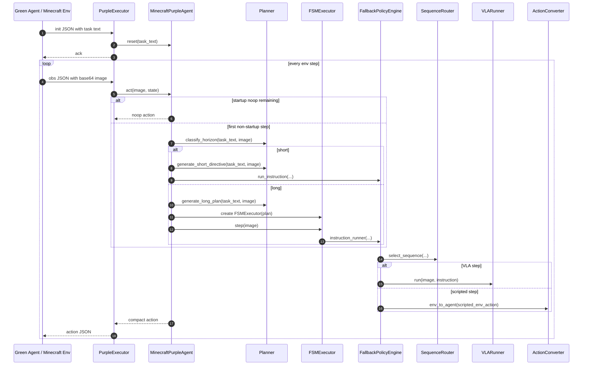

# Purple Agent Logic Analysis

Branch: `refactor/purple-agent-cleanup`

This document explains the current Purple Agent implementation in
`AgentBeats-JarvisVLA/src` after the refactor. The agent is an A2A-compatible
Minecraft policy server: Green Agent owns the benchmark environment and sends
task text plus observations, while this Purple Agent returns one compact
Minecraft action per observation.

## 1. High-Level Role

The Purple Agent is not a single end-to-end neural policy. It is a layered
controller:

1. A2A server adapter receives JSON messages from Green Agent.
2. `MinecraftPurpleAgent` owns one episode runtime and decides whether the task
   should be handled as a short direct instruction or a long staged plan.
3. `Planner` uses an OpenAI-compatible LLM/VLM endpoint to classify horizon,
   generate short directives, and generate long FSM-style plans.
4. `FSMExecutor` runs long plans as timeout-only states.
5. `FallbackPolicyEngine` chooses between pure JarvisVLA execution, scripted
   execution, or hybrid execution.
6. `VLARunner` calls JarvisVLA for visual action generation.
7. `ActionConverter` converts scripted env-style actions into the compact
   Purple Agent `(buttons, camera)` format.

The important design invariant is simple: every runtime failure should degrade
to a noop action instead of breaking the Green Agent evaluation loop.

## 2. Source Map

```text
src/
├── server/
│   ├── app.py                 # CLI, uvicorn, A2A AgentCard
│   ├── executor.py            # A2A JSON -> MinecraftPurpleAgent adapter
│   └── session_manager.py     # session/context registry
├── protocol/
│   └── models.py              # InitPayload, ObservationPayload, ActionPayload
├── agent/
│   ├── agent.py               # MinecraftPurpleAgent orchestrator
│   ├── fallback_policy.py     # policy selection + primitive runtime cursor
│   ├── sequence_router.py     # keyword/hint sequence routing
│   ├── sequence_templates.py  # sequence catalog + primitive templates
│   ├── primitive_scripts.py   # low-level scripted env-action patterns
│   └── vla_runner.py          # JarvisVLA wrapper
├── planner/
│   ├── planner.py             # LLM horizon/directive/plan/VQA logic
│   ├── prompt_template.py     # LLM prompts
│   ├── plan_format.py         # simplified plan <-> canonical FSM
│   ├── validator.py           # plan validation
│   └── instruction_registry.py# instructions.json key canonicalization
├── executor/
│   └── fsm_executor.py        # timeout-only FSM runner
└── action/
    └── converter.py           # env action <-> compact agent action
```

## 3. Wire Protocol

Green Agent sends text JSON over A2A. `PurpleExecutor.handle_message()` is the
unified entry point.

### Init

```json
{
  "type": "init",
  "text": "Defeat the nearby zombie using weapons and protective gear."
}
```

The executor calls:

```text
PurpleExecutor._handle_init
-> MinecraftPurpleAgent.reset(task_text)
-> MinecraftPurpleAgent.initial_state(task_text)
```

It returns:

```json
{
  "type": "ack",
  "success": true,
  "message": "Initialized"
}
```

### Observation

```json
{
  "type": "obs",
  "step": 12,
  "obs": "<base64 jpeg or png>"
}
```

The executor decodes `obs` into an RGB numpy image and calls:

```text
MinecraftPurpleAgent.act(obs={"image": image}, state=context_state)
```

It returns:

```json
{
  "type": "action",
  "action_type": "agent",
  "buttons": [0],
  "camera": [60]
}
```

`buttons` and `camera` are compact categorical indices. `camera=60` is the
center of the 11x11 camera grid, so `buttons=[0], camera=[60]` is the canonical
noop.

## 4. End-to-End Execution Flow



## 5. `PurpleExecutor`

`src/server/executor.py` is intentionally thin. Its responsibilities are:

- Parse incoming JSON.
- Validate payloads with Pydantic models.
- Maintain one `AgentState` per A2A context id.
- Decode observation images.
- Convert returned action dictionaries into `ActionPayload`.
- Return noop on malformed observation, missing context, image decode failure, or
  invalid action shape.

The executor does not decide task strategy. It only bridges A2A messages to
`MinecraftPurpleAgent`.

One important limitation remains: `PurpleExecutor` owns a single
`MinecraftPurpleAgent` instance and stores many `AgentState` objects. That is
fine for one active benchmark context, but true concurrent contexts would still
share the same underlying agent runtime, VLA history, fallback runtime cursor,
and episode fields. If concurrent evaluation becomes important, the executor
should create one `MinecraftPurpleAgent` per context.

## 6. `MinecraftPurpleAgent`

`src/agent/agent.py` is the top-level orchestrator. It holds:

- `Planner` for LLM planning.
- `VLARunner` for JarvisVLA inference.
- `ActionConverter` for scripted action conversion.
- `FallbackPolicyEngine` for policy selection and execution.
- Optional `FSMExecutor` for long-horizon mode.
- Episode fields such as `_task_text`, `_plan`, `_episode_dir`, and
  `_execution_mode`.

### Reset

`reset(task_text)` clears the previous runtime and saves any existing episode
result before starting a new episode.

It also calls `self.vla_runner.reset()` so JarvisVLA history does not leak
between tasks.

If `task_text` is present, it sets:

```text
_startup_noop_remaining = 5
_post_startup_assessed = False
_execution_mode = "idle"
```

The five startup noop steps give Minecraft time to settle after reset or spawn.

### Act

`act(obs, state)` has three phases.

#### Phase A: startup noop

If `_startup_noop_remaining > 0`, the method decrements the counter and returns
noop. No LLM or VLA call happens during this phase.

#### Phase B: first post-startup assessment

On the first real observation, `_post_startup_assess(image)` runs exactly once.

It calls:

```text
Planner.classify_horizon(task_text, observation_image=image)
```

If the result is `short`, it calls `generate_short_directive()`, canonicalizes
the instruction if possible, builds a short `state_def`, saves `plan.json`, and
sets:

```text
_execution_mode = "short"
_short_instruction = "<instruction>"
_short_instruction_type = "<auto|normal|recipe|simple>"
```

If the result is `long`, it calls `generate_long_plan()`, creates an
`FSMExecutor`, saves `plan.json`, and sets:

```text
_execution_mode = "long"
_executor = FSMExecutor(...)
```

#### Phase C: per-step action

In short mode:

```text
FallbackPolicyEngine.run_instruction(image, short_instruction, ...)
```

is called every step.

In long mode:

```text
FSMExecutor.step(image)
```

is called every step. The FSM in turn calls the same fallback policy engine for
the current state's instruction.

If the packet is not in the internal action packet format, the agent returns
noop.

## 7. Planner Logic

`src/planner/planner.py` owns the LLM-facing logic. It supports four operations:

1. `classify_horizon()`
2. `generate_short_directive()`
3. `generate_long_plan()`
4. `vqa_check_subgoal()`

The refactor made the OpenAI-compatible client injectable and optional. If the
`openai` package is unavailable, the planner can still be constructed; actual
LLM calls return an empty response and the planner's fallback behavior is used.
This improves local smoke-testability without changing production behavior when
the package and credentials are present.

### Horizon Classification

`classify_horizon()` asks the LLM to return:

```json
{"horizon": "short"}
```

or:

```json
{"horizon": "long"}
```

If parsing fails, `fallback_classify_task_horizon()` is used. The heuristic only
marks explicit "from scratch" or empty-inventory tasks as long; otherwise it
prefers short.

### Short Directive

`generate_short_directive()` tries to produce a single JarvisVLA instruction:

```json
{
  "instruction": "kill_entity:zombie",
  "instruction_type": "auto"
}
```

It prefers strict `instructions.json` keys such as:

- `kill_entity:zombie`
- `mine_block:diamond_ore`
- `craft_item:furnace`
- `pickup:apple`
- `use_item:shield`
- `drop:torch`

If the LLM returns a malformed or non-canonical instruction, the planner tries
to repair it using the local registry and task text tokens. If repair fails, it
falls back to the raw task text with `instruction_type="normal"`.

### Long Plan

`generate_long_plan()` asks the LLM for a simplified FSM plan:

```json
{
  "task": "mine diamond from scratch",
  "step1": {
    "instruction": "mine_block:stone",
    "instruction_type": "auto",
    "execution_hint": "vla",
    "condition": {"type": "timeout", "max_steps": 3600, "next": "step2"}
  },
  "step2": {
    "instruction": "craft_item:iron_pickaxe",
    "instruction_type": "recipe",
    "execution_hint": "hybrid",
    "condition": {"type": "timeout", "max_steps": 2400, "next": "fallback"}
  },
  "fallback": {
    "instruction": "mine diamond from scratch",
    "instruction_type": "normal",
    "execution_hint": "vla",
    "condition": {"type": "always", "next": "fallback"}
  }
}
```

The planner then normalizes and validates the plan:

```text
raw JSON
-> to_canonical_plan()
-> normalize_instruction_keys()
-> ensure_timeout_fallback()
-> PlanValidator.validate()
-> validate_long_horizon_constraints()
-> canonical_to_simplified_plan()
```

Non-fallback strict-key states are validated against `instructions.json` when
the registry is available. Free-form natural-language instructions are allowed
for subgoals where strict keys are not suitable.

## 8. FSM Executor

`src/executor/fsm_executor.py` interprets a canonical FSM plan. It does not own
the Minecraft environment loop. Each `step(image)` call returns at most one
action packet.

The FSM is intentionally timeout-only:

- `always`: transition immediately.
- `timeout`: transition when `state_step_count >= max_steps`.

There is an optional periodic VQA checker, but the main transition model is
step-count based. This is safer for competition rollout because visual
completion checks can be noisy.

The key counters are:

- `current_state`
- `state_step_count`
- `total_step_count`
- `global_max_steps`
- `finished`
- `result`

The executor uses a bounded loop of 64 transition evaluations so an accidental
cycle of immediate `always` transitions cannot recurse forever.

## 9. Policy Selection After Refactor

`src/agent/fallback_policy.py` is now a runtime engine rather than a giant
configuration file. It does three jobs:

1. Build or reuse a policy spec for the current instruction.
2. Execute either pure VLA or a primitive sequence.
3. Maintain primitive cursor state across environment steps.

The data it previously embedded was moved into:

- `sequence_templates.py`: sequence catalog and primitive templates.
- `primitive_scripts.py`: deterministic motor action patterns.

### Policy Spec

`make_policy_spec()` returns:

```python
{
    "execution_hint": "vla" | "scripted" | "hybrid",
    "sequence_name": "drop_cycle" | None,
    "primitives": [...],
    "selector_reason": "keyword_priority" | "planner_hint" | ...
}
```

Selection priority:

1. If `state_def["primitives"]` exists, use it directly.
2. Route by raw `task_text` first. This intentionally overrides planner mistakes
   such as mapping "lay carpet" into a craft instruction.
3. If the planner supplied a concrete `sequence_name` with `scripted` or
   `hybrid`, honor it.
4. Otherwise ask `SequenceRouter`.
5. If a scripted/hybrid hint cannot resolve a concrete sequence, fall back to
   pure VLA.

### Runtime Signature

The policy engine builds a signature from:

```text
instruction | state_def.description | state_def.instruction_type
```

If the signature has not changed, it reuses the previous policy spec and
continues the existing primitive cursor. If the signature changes, it resets:

- `_script_runtime_step`
- `_primitive_runtime_index`
- `_primitive_runtime_step`

This is what lets a multi-step primitive sequence progress one action at a time
across repeated `obs` messages.

## 10. Sequence Router

`src/agent/sequence_router.py` is a deterministic keyword router. It combines
the current instruction and `task_text`, normalizes underscores to spaces, and
checks ordered keyword rules.

Examples:

- "look at the sky" -> `view_upward`
- "drop a torch" -> `drop_cycle`
- "lay carpet" -> `line_place_repeat`
- `craft_item:*` -> `open_inventory_craft`
- "drink potion" -> `consume_cycle`
- "plant wheats" -> `approach_farmland_then_plant_rows`
- "item frame" -> `approach_then_vertical_place`
- "chest" -> `approach_then_open_interactable`

Rule order matters. For example, "lay carpet" must be matched before generic
crafting rules so it becomes a placement sequence rather than a crafting GUI
sequence.

## 11. Sequence Templates

`src/agent/sequence_templates.py` maps sequence names to primitive steps.

Example:

```python
"drop_cycle": [
    {"executor": "script", "primitive": "drop_cycle", "steps": 90},
]
```

Example hybrid sequence:

```python
"approach_then_vertical_place": [
    {
        "executor": "vla",
        "instruction": "face a nearby wall or vertical surface and move close to it",
        "instruction_type": "normal",
        "steps": 30,
    },
    {
        "executor": "vla",
        "instruction": "select an item frame, painting, or wall decoration from your hotbar",
        "instruction_type": "normal",
        "steps": 20,
    },
    {"executor": "script", "primitive": "place_wall_use", "steps": 90},
]
```

Each primitive has:

- `executor="vla"`: call JarvisVLA with an instruction.
- `executor="script"`: call deterministic primitive script.
- `steps`: local budget for that primitive.

If no template matches, the default is a single long-running VLA primitive.

## 12. Primitive Scripts

`src/agent/primitive_scripts.py` returns expanded env-style actions such as:

```python
{"forward": 1, "sprint": 1}
{"use": 1}
{"camera": [9.0, 0.0]}
{"hotbar.1": 1}
```

These scripts are intentionally simple cyclic controllers. Examples:

- `drop_held_item`: cycle hotbar slots and press drop.
- `cycle_hotbar_then_hold_use`: scan hotbar and hold use.
- `stack_vertical`: select a block, look down, then jump-place while sneaking.
- `attack_walk_sweep`: sweep forward while attacking and rotating.
- `place_wall_use`: walk into a wall, place, and rotate.
- `mine_forward`: select tool, face block, hold attack, rotate.

The policy engine converts the returned env action using `ActionConverter`.

## 13. VLARunner

`src/agent/vla_runner.py` wraps `jarvisvla.evaluate.agent_wrapper.VLLM_AGENT`.

For each VLA step it:

1. Resolves instruction type:
   - explicit `simple`, `normal`, or `recipe` are honored.
   - `craft_item:*` becomes `recipe`.
   - known prompt library keys become `normal`.
   - otherwise use the configured default.
2. Temporarily updates `self.agent.instruction_type`.
3. Calls `VLLM_AGENT.forward(observations=[image], instructions=[instruction])`.
4. Normalizes action output into one scalar button and one scalar camera index.
5. Optionally converts camera from JarvisVLA 21x21 space to MineStudio 11x11
   space.

If VLA inference fails, it returns a noop packet.

## 14. Action Format

Internal packet format:

```python
{
    "__action_format__": "agent",
    "action": {
        "buttons": np.array([button_idx]),
        "camera": np.array([camera_idx]),
    },
}
```

Wire format:

```json
{
  "type": "action",
  "action_type": "agent",
  "buttons": [123],
  "camera": [60]
}
```

Scripted primitives produce expanded env actions, and `ActionConverter` maps
them to the compact form. When MineStudio conversion utilities are installed,
it uses their native converters. Otherwise it uses the local numpy fallback.

## 15. Failure Handling

The system is designed to keep the benchmark loop alive:

- invalid JSON -> ack failure or noop
- missing init context -> noop
- image decode failure -> noop
- missing observation image -> noop
- planner client unavailable -> fallback heuristic / empty LLM response
- invalid plan execution -> FSM termination or noop
- VLA inference exception -> noop packet
- unexpected action packet -> noop
- action conversion failure -> noop

This is important because Green Agent expects one response per environment
step. Dropping a response is usually worse than returning a harmless noop.

## 16. Refactor Summary

The main refactor was a responsibility split:

Before:

```text
fallback_policy.py
  policy selection
  sequence catalog
  primitive templates
  primitive runtime cursor
  low-level scripted motor macros
  env-action conversion helper
```

After:

```text
fallback_policy.py
  policy selection
  primitive runtime cursor
  VLA/script dispatch

sequence_templates.py
  sequence catalog
  primitive templates

primitive_scripts.py
  deterministic motor macro definitions
```

This keeps runtime behavior conceptually the same while making the system much
easier to test and modify. Adding a new scripted skill should now usually mean:

1. Add or edit a keyword route in `sequence_router.py`.
2. Add a sequence entry in `sequence_templates.py`.
3. Add a primitive env-action pattern in `primitive_scripts.py` if needed.
4. Add a routing or primitive test.

## 17. Current Known Design Risks

1. `MinecraftPurpleAgent` still stores mutable episode state internally while
   `PurpleExecutor` also stores `AgentState` per context. This is workable for a
   single active context, but not ideal for concurrent contexts.
2. `SequenceRouter` is keyword-based. It is predictable and cheap, but rule
   order is a behavioral contract and should be protected with tests.
3. Planner fallback behavior prefers short tasks unless "from scratch" style
   wording appears. That is safe for many MCU tasks but can under-plan ambiguous
   multi-step tasks.
4. Scripted primitives are open-loop. They do not know whether an item was
   selected, placed, consumed, or dropped successfully.
5. Long-horizon transitions are mostly time budget based. This avoids VQA noise
   but may move on too early or too late depending on spawn/world conditions.

## 18. Recommended Next Tests

Useful tests to add after this refactor:

- `SequenceRouter` golden tests for each MCU task family.
- `default_primitives()` tests for key sequences.
- `primitive_env_action()` tests for representative local steps.
- `FallbackPolicyEngine` runtime cursor tests across multiple calls.
- `PurpleExecutor` protocol tests for invalid JSON, obs-before-init, and image
  decode failure.
- Planner tests with a fake injected client returning malformed JSON and valid
  JSON.
